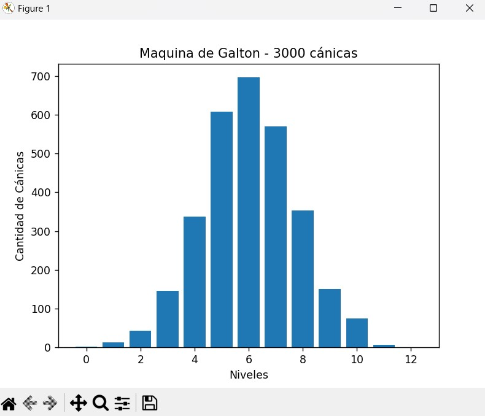

# Máquina de Galton
Desarrollo de Máquina de Galton - 3000 Cánicas

## Desarrollado con
* Python

### Instruccciones
* Es necesario descargar Python en nuestra computadora desde el sitio oficial (https://www.python.org/)
* Una vez instalado Python, hay que clonar el repositorio - (https://github.com/wallace3/imc.git)
* Se debe instalar la librería matplotlib e importar pyplot a nuestro proyecto
* Importar la librería numpy a nuestro proyecto, para la función de rand
* Clonado el repositorio en nuestra maquina, hay que ejecutar el archivo grafica.py

### Cómo funciona 
* El programa ejecuta dos funciones, la primera, para obtener los resultados de las cánicas y el total de los niveles
* La segunda, la encargada de gráficar los resultados
* El resultado es el que se muestra a continuación

### Autor
* Ing. Edgar Azael Hernández Bedolla

### Conocimientos y Agradecimientos
* Softwware desarollado gracias a los conocimientos básicos de uCamp en conjunto con UTEL Universidad
* Gracias a UCamp, que, dentro de 4 meses de aprendizaje, ha guíado a los alumnos a entender los conceptos básicos de Python pero que sin duda, son la base para ir construyendo conocimiento.
* Python es un lenguaje de programación con bastante tiempo y en constante evolución en el cual me gustaría profesionalizarme.

